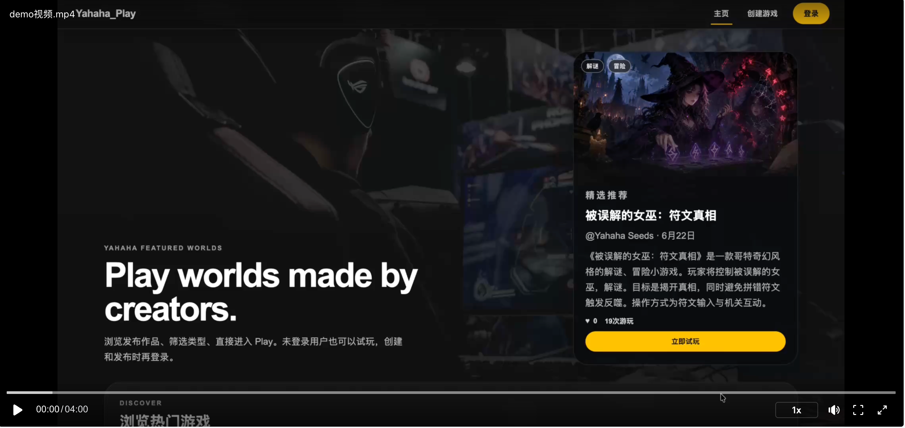
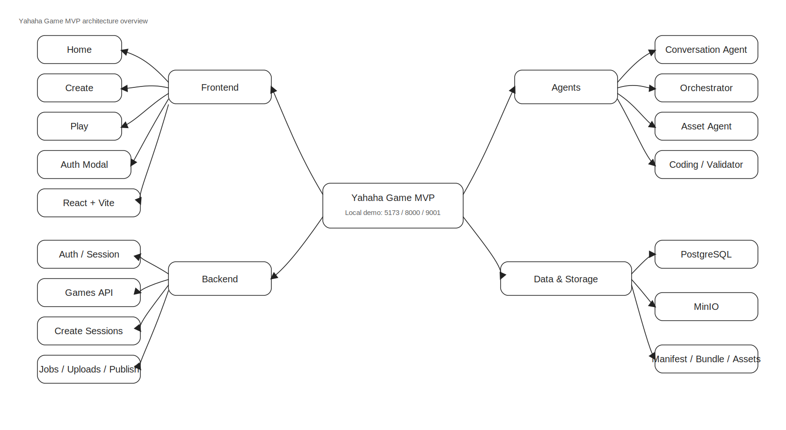
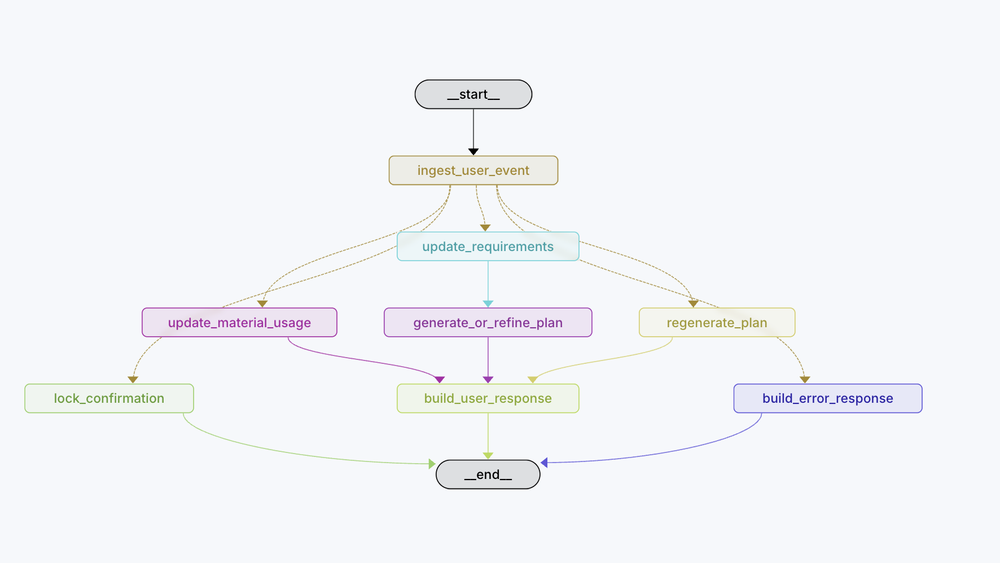
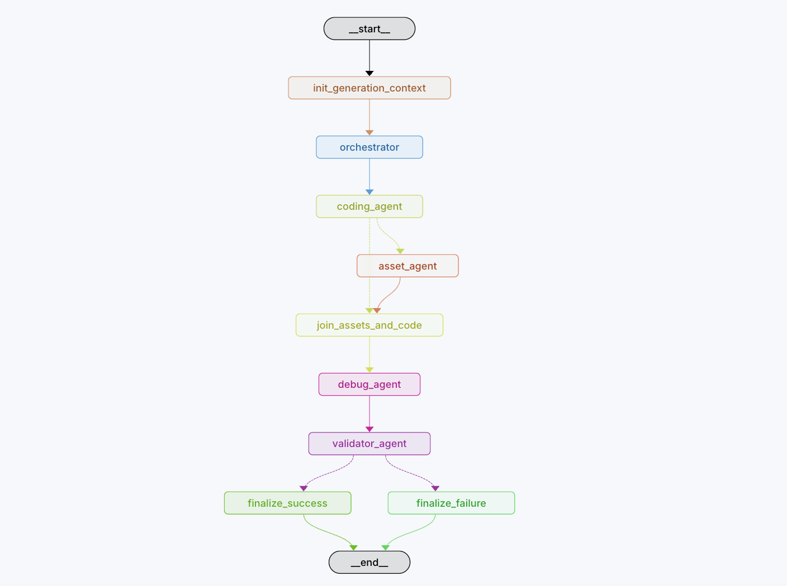

# Yahaha Game

AI Native 互动游戏平台 MVP，目标是在短周期内打通「登录/注册 -> 创意生成 -> 游戏发布 -> 浏览游玩」的真实业务闭环。

项目当前采用 `React + Vite + FastAPI + PostgreSQL + MinIO + LangGraph`。产品范围、页面规则、接口契约、Agent 编排和实施进度均已沉淀在 `docs/` 目录，可作为交付说明与后续迭代的事实来源。

## 项目概览

- 系统设计总览：见 [docs/system-design-document.md](./docs/system-design-document.md)。
- 产品设计：见 [docs/design-document.md](./docs/design-document.md)。
- 页面与交互：见 [docs/pages-design.md](./docs/pages-design.md)。
- 技术栈与运行边界：见 [docs/tech-stack.md](./docs/tech-stack.md)。
- API 契约：见 [docs/api-contract.md](./docs/api-contract.md)。
- Agent 编排：见 [docs/agent-orchestration-design.md](./docs/agent-orchestration-design.md)。
- 架构与目录职责：见 [docs/architecture.md](./docs/architecture.md)。
- 当前完成度与验证记录：见 [docs/progress.md](./docs/progress.md)。

## 演示视频



演示视频见飞书链接
https://my.feishu.cn/file/CWzAb3CkIoegb8xp9HWcmdTqnjd?from=from_copylink

## Demo 地址

当前交付仅提供本地可运行 Demo。启动完成后，可访问以下地址：

- 前端：`http://localhost:5173`
- 后端接口：`http://localhost:8000`
- Swagger：`http://localhost:8000/docs`
- MinIO Console：`http://localhost:9001`
- MinIO 默认账号：`yahaha123`
- MinIO 默认密码：`yahaha123`

## 启动命令

推荐前后端一起通过 Docker 启动：

```bash
cp .env.example .env
docker compose --profile docker-frontend up --build
```

如需本地启动 LangGraph 调试界面，可额外执行：

```bash
cd lan_agents
langgraph dev
```

`langgraph dev` 用于本地启动 Agent 图调试服务，便于在浏览器中查看 `conversation_graph` 和 `generation_graph` 的加载、状态流转与节点执行情况。

如需只启动后端、数据库、对象存储等基础服务，前端在本地开发运行，可改用：

```bash
docker compose up --build
cd frontend
npm install
npm run dev
```

容器编排和端口约定见 [docs/tech-stack.md](./docs/tech-stack.md) 与 [docs/architecture.md](./docs/architecture.md)。

## 测试数据

PRD 要求系统至少提供 3 个示例游戏，且至少 1 个来自 Create 发布闭环。当前仓库已实现可重复执行的 seed 能力，并以内置 `examples/` 目录中的 5 套真实 bundle 作为 published 示例游戏来源：`被误解的女巫：符文真相`、`精灵小兽`、`哈利的魔法追击`、`小镇物语：职业日常`、`小花仙的花瓣收集换装之旅`。详细说明见 [docs/progress.md](./docs/progress.md) 和 [docs/design-document.md](./docs/design-document.md)。

## 环境变量

根目录提供 `.env.example`。其他用户本地复现时，建议优先确认以下核心变量：

| 参数 | 含义 |
| --- | --- |
| `VITE_API_PROXY_TARGET` | Vite 本地代理目标地址，通常指向本地后端。 |
| `FRONTEND_ORIGIN` | 后端允许的主前端来源，用于 CORS 和 OAuth 回跳。 |
| `POSTGRES_DB` | PostgreSQL 数据库名。 |
| `POSTGRES_USER` | PostgreSQL 用户名。 |
| `POSTGRES_PASSWORD` | PostgreSQL 密码。 |
| `DATABASE_URL` | 后端实际使用的数据库连接串。 |
| `MINIO_ENDPOINT` | 后端或容器内部访问 MinIO 的地址。 |
| `MINIO_PUBLIC_ENDPOINT` | 浏览器访问 MinIO 公共资源时使用的地址。 |
| `MINIO_ACCESS_KEY` | MinIO 访问账号。 |
| `MINIO_SECRET_KEY` | MinIO 访问密钥。 |
| `MINIO_BUCKET` | 对象存储 bucket 名称。 |
| `SESSION_SECRET` | 服务端 session 签名密钥。 |
| `MODEL_PROVIDER` | 当前启用的模型 provider，例如 `mock` 或 `openai-compatible`。 |
| `OPENAI_COMPATIBLE_BASE_URL` | 当 `MODEL_PROVIDER=openai-compatible` 时，需要提供模型服务地址。 |
| `OPENAI_COMPATIBLE_API_KEY` | 当 `MODEL_PROVIDER=openai-compatible` 时，需要提供模型服务密钥。 |
| `OPENAI_COMPATIBLE_MODEL` | 当 `MODEL_PROVIDER=openai-compatible` 时，需要提供模型名。 |

更多环境与运行边界说明见 [docs/tech-stack.md](./docs/tech-stack.md)。

## 系统设计文档

1. 系统设计文档：见 [docs/system-design-document.md](./docs/system-design-document.md)。
2. 产品设计：见 [docs/design-document.md](./docs/design-document.md)。
3. 页面与交互：见 [docs/pages-design.md](./docs/pages-design.md)。
4. 技术栈与运行边界：见 [docs/tech-stack.md](./docs/tech-stack.md)。


## 技术栈

当前技术栈如下：

| 模块 | 技术选型 | 简要说明 |
| --- | --- | --- |
| 前端 | `React + Vite + Ant Design` | 构建 Home、Create、Play 和 Auth Modal 的 SPA。 |
| 后端 | `FastAPI` | 提供认证、游戏、Create、Jobs、Uploads 和 Play Events API。 |
| 数据库 | `PostgreSQL` | 存储用户、会话、游戏、任务、素材、日志和事件。 |
| 对象存储 | `MinIO` | 保存上传素材、draft 产物和 published bundle。 |
| Agent 框架 | `LangGraph` | 编排对话设计阶段与后台生成阶段。 |
| 模型服务 | `Mock provider / OpenAI-compatible API` | 本地可用 mock，真实生成走 OpenAI-compatible 接口。 |
| 异步任务 | `FastAPI BackgroundTasks` | 驱动生成任务状态流和后台执行。 |
| 部署方式 | `Docker Compose` | 本地启动后端、数据库、对象存储与可选前端容器。 |

完整说明见 [docs/tech-stack.md](./docs/tech-stack.md)。

## 完成度说明

| 模块 | 已实现 | 未实现 |
| --- | --- | --- |
| 登录注册 | 1、邮箱注册。2、邮箱登录。3、退出登录。4、session 状态查看与受保护页面访问控制。5、Google OAuth 授权跳转、回调与账号绑定代码路径。 | GitHub OAuth 真实跑通。 |
| 主页 Home | 1、展示平台内所有已发布互动游戏。2、展示封面、标题、作者、简介、标签、发布时间等核心信息。3、支持直接进入 Play。4、支持搜索、标签筛选、最新发布 / 最多游玩 / 最多点赞排序。5、支持点赞与游玩次数统计展示。6、侧栏游戏详情页 | 1、独立游戏详情页。2、收藏功能。 |
| 游玩 Play | 1、点击互动游戏后根据数据库中的 meta 信息动态加载对象存储中的远端游戏文件。2、通过 `manifest_url`、`artifact_base_url` 和 sandboxed iframe 在 Web 端运行。3、已接入 `meta -> manifest -> iframe` 的真实加载链路。4、已支持 `view / manifest_loaded / started / failed / timeout / exited` 事件上报。5、已提供加载失败、超时与重新加载处理。 | 1、Play 性能统计沉淀与展示仍未补齐。2、加载速度与体验优化仍有继续打磨空间。 |
| 创建 Create | 1、支持文字创意输入。2、支持任意文件上传，覆盖文件 / 图片 / 视频等多模态素材输入。3、后端已通过 LangGraph Multi-Agent 架构生成互动游戏产物。4、生成结果会上传到对象存储指定路径，并将 meta 与任务状态写入数据库。5、可在页面中看到任务进度、产物地址、数据库记录、Agent 执行日志和可试玩结果。6、支持 draft 试玩与发布到 Home。 | 1、失败重试。2、版本管理。3、Remix 派生。4、安全沙箱可视化配置。5、内容审核。6、资源限额。7、生成成本统计。 |
    
如果再给 1 周，优先迭代：

1. 用户作品管理页：展示自己的 draft、published 和 deleted 游戏。
2. 发布后编辑游戏 meta：标题、简介、标签、封面。
3. 取消发布和重新发布。
4. 收藏和分享。
5. 任务 Retry、Cancel 和版本管理。
6. Remix 派生。
7. 安全沙箱可视化配置、内容审核、资源限额和生成成本统计。
8. 平台维护者后台：内容审核、任务监控、产物下架。
9. GitHub OAuth 真实跑通，以及多 provider 账号绑定管理。
10. Play 性能统计：manifest 加载耗时、iframe ready 耗时、运行错误率。
## 测试与验证证据

仓库已保留后端 pytest、前端构建、LangGraph 校验、seed 写入和 MinIO 可访问性等验证记录；本地常用验证命令包括：

```bash
python3 -m venv .venv
.venv/bin/pip install -r backend/requirements.txt
.venv/bin/pytest backend/tests
docker compose exec -T backend alembic upgrade head
cd frontend
npm install
npm run build
```

评委验证时可直接使用 `docker compose --profile docker-frontend up --build`。backend 容器启动时会自动执行 seed，把 `被误解的女巫：符文真相`、`精灵小兽`、`哈利的魔法追击`、`小镇物语：职业日常`、`小花仙的花瓣收集换装之旅` 这 5 个示例游戏写入真实数据库与 MinIO 的 `published/*` 路径，因此首次打开 `http://localhost:5173` 时，Home 默认就能看到这 5 个已发布游戏。

最新证据以 [docs/progress.md](./docs/progress.md) 为准，接口与页面验收口径见 [docs/implementation-plan.md](./docs/implementation-plan.md)。


## AI 协作记录

使用AI工具：Codex。

关键 prompt 主要分为两类：

1、项目级开发约束 prompt：要求 AI 在每个 step 前阅读架构与设计文档、按 step 实施、完成后更新 [docs/architecture.md](./docs/architecture.md) 和[docs/progress.md](./docs/progress.md) ；

2、实现计划 prompt：用于把任务拆成可验证的小步；

eg:
[docs/agent-implementation-plan.md](.docs/agent-implementation-plan.md)、[docs/backend-implementation-plan.md](.docs/backend-implementation-plan.md)、[docs/frontend-implementation-plan.md](.docs/frontend-implementation-plan.md)


Review 方法包括：

- 逐 step 检查实现是否符合设计文档和实施计划；
- 检查 API、状态字段、目录边界和文档职责是否一致；
- 对前端页面做手工验收，通过Swagger检查后端接口，通过LangSmith检查Agent流程

Test 方法包括：

- 后端使用 pytest 覆盖认证、会话、上传、游戏列表、点赞、Play events、任务和健康检查；
- 前端使用 npm run build 和多组脚本检查页面结构、Home API、Play runtime、Create 对话、上传、确认卡片等行为；
- Agent 使用 pytest、langgraph validate、LangGraph dev server 和 LangSmith trace 验证 conversation graph、generation graph、provider、Orchestrator、Asset Agent、Coding Agent 和 debug 节点。


## 总体架构

系统采用前端 SPA、FastAPI 后端、FastAPI `BackgroundTasks` 异步任务、LangGraph Agent Orchestrator、PostgreSQL 数据库、MinIO 对象存储和 sandboxed iframe 运行时隔离协同工作的分层架构。




## 数据模型

当前核心数据模型如下：

- `users`：系统用户主表，承载邮箱账号、展示名和头像等基础身份信息。
- `oauth_accounts`：第三方登录绑定表，承载 Google / GitHub 等 provider 身份映射。
- `sessions`：服务端登录会话表，维护当前登录态。
- `games`：游戏元信息表，承载标题、简介、封面、标签、发布状态和产物地址。
- `game_likes`：用户与游戏的点赞关系表。
- `generation_jobs`：生成任务表，承载任务状态、确认快照、产物路径和失败原因。
- `create_sessions`：Create 对话会话表，承载确认前需求收集、方案状态和最近一轮 AI 回复。
- `create_session_messages`：Create 聊天历史表，用于恢复完整消息气泡。
- `uploaded_assets`：用户上传素材表，支持先上传、后绑定会话或任务。
- `agent_logs`：Agent 执行日志表，用于 Create 任务过程展示和排障。
- `play_events`：Play 埋点事件表，用于记录 view、started、timeout 等游玩行为。

详细字段、关系和约束可见 [docs/data-model.md](./docs/data-model.md)。

## Agent 编排

Create界面的Agent编排采用Langraph框架，分为两个子图：负责与用户对话并整理需求的对话图`conversation_graph` 和负责生成游戏的生成图`generation_graph`。

角色包括以下 Agent：

| Agent 名称 | 说明 |
| --- | --- |
| `Conversation Agent` | 通过与用户对话，完善游戏设计需求。 |
| `Orchestrator` | 读取需求快照，生成开发文档、素材任务单和并发执行合同，指挥Asset Agent和Coding Agent干活。 |
| `Asset Agent` | 负责处理或生成运行所需素材资源，并将资源写入约定产物路径。 |
| `Coding Agent` | 面向游戏生成阶段，负责生成静态游戏 bundle，包括 `index.html`、`style.css`、`game.js` 和 `manifest` 草稿，并在资源到齐后进行自调试。 |
| `Validator Agent` | 面向游戏生成阶段，负责最终交付验收，检查产物协议、安全边界、资源完整性和可交付状态。 |

顶层结构：

```text
START
  -> conversation_graph
  -> user_confirmed?
    -> no: return game card / continue chat
    -> yes: generation_graph
  -> END
```

`conversation_graph` 是一个面向 Create 页对话体验的 LangGraph 子图，只负责需求收集和方案确认，不生成游戏代码和静态 bundle，结构如下：



第二阶段使用 `generation_graph`。它是面向后端异步任务的 LangGraph 子图，只负责用户确认游戏方案后的游戏生成执行，不和用户继续对话。




详细Agent设计说明见 [docs/agent-orchestration-design.md](./docs/agent-orchestration-design.md) 

## 远端产物协议

游戏产物按静态 Web bundle 交付，最小结构如下：

```text
manifest.json
index.html
style.css
game.js
assets/*
```

`manifest.json` 字段结构如下：

```json
{
  "schemaVersion": "1.0",
  "title": "Space Runner",
  "description": "A small arcade game generated from user prompt.",
  "entry": "index.html",
  "styles": ["style.css"],
  "scripts": ["game.js"],
  "assets": ["assets/cover.png"],
  "cover": "assets/cover.png",
  "controls": ["Arrow keys to move", "Space to jump"],
  "runtime": "html5-iframe",
  "generatedAt": "2026-06-19T00:00:00Z"
}
```

当前项目实际使用的对象存储路径格式如下：

```text
uploads/{user_id}/{upload_id}/{filename}
drafts/{user_id}/{job_id}/{version}/manifest.json
drafts/{user_id}/{job_id}/{version}/index.html
published/{game_id}/{version}/manifest.json
published/{game_id}/{version}/index.html
published/{game_id}/{version}/assets/*
```

当前访问策略如下：

- `uploads/*` 私有，通过 presigned URL 访问。
- `drafts/*` 私有，仅创建者通过后端授权预览。
- `published/*` public-read，Play 可直接加载。

Play 页面通过后端返回的 `manifest_url` 与 `artifact_base_url` 动态加载远端内容，并在 sandboxed iframe 中运行。详细协议见 [docs/tech-stack.md](./docs/tech-stack.md)、[docs/api-contract.md](./docs/api-contract.md) 和 [docs/design-document.md](./docs/design-document.md)。

## 安全隔离

安全边界覆盖上传素材、对象存储读写、日志脱敏、生成代码运行隔离和 iframe sandbox。当前设计要求不在日志或响应中暴露密钥、token、完整 presigned URL，并限制生成产物只作为静态文件在浏览器 iframe 中执行。详细说明见 [docs/design-document.md](./docs/design-document.md)、[docs/backend-implementation-plan.md](./docs/backend-implementation-plan.md) 和 [docs/agent-implementation-plan.md](./docs/agent-implementation-plan.md)。

## 失败恢复

失败恢复覆盖模型调用失败、任务失败、上传失败、发布失败、manifest 加载失败和 iframe 超时等场景。前端需要展示明确错误态与重试提示，后端与 Agent 需要返回可读的 `error_message`、`retry_hint` 和失败步骤。详细说明见 [docs/pages-design.md](./docs/pages-design.md)、[docs/backend-implementation-plan.md](./docs/backend-implementation-plan.md) 和 [docs/agent-orchestration-design.md](./docs/agent-orchestration-design.md)。

## 可观测性

可观测性主要依赖任务状态、Agent 日志、Play 事件、前端 Console 输出和 LangSmith tracing。Create 需要展示任务日志摘要，Play 需要输出 meta、manifest、bundle、iframe 与错误信息，后端需要保存结构化日志与事件记录。详细说明见 [docs/agent-orchestration-design.md](./docs/agent-orchestration-design.md)、[docs/pages-design.md](./docs/pages-design.md) 和 [docs/progress.md](./docs/progress.md)。
