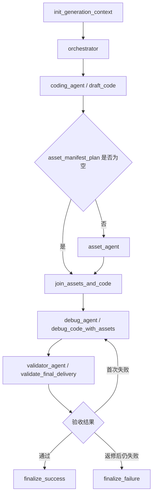

# Generation Graph 流程说明

本文档说明 `lan_agents/src/agent/generation_graph/` 的当前执行流程，重点回答三个问题：

1. `generation graph` 从输入到交付的完整链路是什么。
2. `validator_agent` 最终验收具体验收什么。
3. 当前实现里的 `reflection` 是怎么工作的，边界在哪里。

## 1. 图的职责

`generation graph` 是阶段 B 的生成子图。它接收已经确认过的 `create_session` 快照、游戏方案和素材上下文，输出一套可交付的 draft HTML5 bundle，最终产出：

- `status=succeeded/failed`
- `artifact_result`
- `draft_game_meta`
- `validation_report`
- `agent_logs`

它不负责继续追问需求，也不负责发布到 Home；它只负责把“已确认的游戏方案”变成“通过验收的 draft bundle”。

## 2. 主流程

当前图结构定义在 `lan_agents/src/agent/generation_graph/graph.py`，主干如下：

对应代码边关系见：

- `workflow.add_edge("join_assets_and_code", "debug_agent")`
- `workflow.add_edge("debug_agent", "validator_agent")`
- `workflow.add_conditional_edges("validator_agent", route_after_validation, ...)`

## 3. 各节点做什么

### 3.1 `init_generation_context`

作用：

- 规范 `artifact_workspace`
- 清理并准备输出目录
- 把后端传入的 `uploaded_assets` 收口成安全 `asset_registry`
- 初始化 `generation_status` 和 `agent_logs`

这一层不做内容生成，只做上下文收口和工作区准备。

### 3.2 `orchestrator`

作用：

- 基于已确认的 `game_plan`、`material_usage`、上传素材和类型判断
- 生成 `development_brief`
- 生成 `asset_manifest_plan`
- 对 Coding Agent 和 Asset Agent 的输入做对齐

这里的关键产物不是代码，而是“合同”。后面所有节点都围绕这份合同工作。

### 3.3 `coding_agent / draft_code`

作用：

- 让 LLM 生成 `index.html`、`style.css`、`game.js`、`coding_notes`
- 本地构建 `manifest_draft.json`
- 落盘到 `artifact_workspace`

这一阶段带有一层轻量自校验：

- 字段不能为空
- 不允许远程 URL / CDN
- 不允许 secret / token / presigned URL
- 不允许绝对本地路径
- 代码引用的资产路径必须来自 `asset_manifest_plan`
- `game_js` 必须带 `game_ready` 协议信号

如果第一次生成没过这些本地校验，会把 `previous_attempt_error` 回灌给下一次生成，请模型重出一版完整 bundle。这个环节更像“生成后局部自修正”，还不是完整的最终 `reflection` 主闭环。

### 3.4 `asset_agent`

作用：

- 按 `asset_manifest_plan` 生成或处理素材
- 当前主要处理 `assets/background.png`、`assets/player.png`、`assets/cover.png`
- 支持优先利用上传素材，再决定是否走图片模型或 mock 兜底

如果 Orchestrator 判断运行时不需要视觉素材，图会跳过 `asset_agent`，只保留 `cover.png` 或完全走程序化绘制路径。

### 3.5 `join_assets_and_code`

作用：

- 把代码产物、`manifest_draft`、素材产物和 workspace 路径组装成统一 `integrated_bundle_context`

这一步本身不修东西，它只是把 Debug Agent 需要的上下文收齐。

### 3.6 `debug_agent / debug_code_with_assets`

作用：

- 对当前 bundle 先跑一次本地检查
- 必要时让 LLM 基于错误上下文修一次
- 修完后重新检查
- 输出结构化 `debug_report`

Debug Agent 依赖两类确定性检查：

1. `asset_reference_check`
2. `runtime_check`

`asset_reference_check` 检查：

- 代码里引用的 `assets/*` 是否真实存在
- `manifest_draft.assets` 里的资源是否真实存在
- manifest 是否列了代码没用的旧资源
- 代码是否引用了 manifest 没登记的资源

`runtime_check` 当前是“静态 + Node fallback”方案，不是浏览器真跑。它检查：

- `index.html` 是否存在
- `game.js` 是否存在
- HTML 是否包含 `<canvas>`
- HTML 是否引用 `game.js`
- `node --check game.js` 是否通过
- 是否存在 `game_ready` 信号
- 是否存在渲染信号，如 `fillRect`、`drawImage`、`requestAnimationFrame`
- 是否存在交互信号，如 `keydown`、`click`、`pointerdown`、`touchstart`

Debug Agent 先跑检查，再决定是否返修：

- 如果只是缺 `game_ready`，优先走确定性修复，不调用 LLM
- 如果本地检查或上游 `validation_report` 指出问题，则把当前文件内容、运行检查结果、资产检查结果和 `validation_report` 一起发给 LLM 做一轮 repair
- repair 完后重新跑检查，并把结果写进 `debug_report`

`debug_report` 里会显式记录：

- `fixed_issues`
- `unresolved_issues`
- `runtime_check`
- `asset_reference_check`
- `notes`

### 3.7 `validator_agent / validate_final_delivery`

作用：

- 把 `manifest_draft` 写成最终 `manifest.json`
- 对最终交付 bundle 做确定性验收
- 只负责验收，不负责返修

验收通过时输出：

- `generation_status=succeeded`
- `validation_report.valid=true`
- `artifact_result`
- `draft_game_meta`

验收失败时输出：

- `generation_status=failed`
- `failed_step=validator_agent`
- `error_message`
- `retry_hint`
- `validation_report.valid=false`

### 3.8 `finalize_success` / `finalize_failure`

作用：

- 把子图结果统一收口为后端可落库的成功态或失败态
- 保留 `agent_logs`，供 Create 页进度和错误面板展示

## 4. Validator 最终验收清单

`validator_agent` 的原则是：硬性门禁全部由确定性规则判断，不靠模型自述“我检查过了”。

当前验收范围如下。

### 4.1 manifest 与必需文件

Validator 会检查：

- `manifest.json` 是否存在
- `manifest.json` 是否是合法 JSON
- 入口文件、样式文件、脚本文件是否都存在
- `code_artifacts.files` 里记录的文件路径是否都仍在 `artifact_workspace` 内

### 4.2 manifest 协议字段

Validator 要求 `manifest` 至少包含这些字段：

- `entry`
- `styles`
- `scripts`
- `assets`
- `cover`
- `runtime`
- `generatedAt`

并且：

- `runtime` 必须等于 `html5-iframe`
- `styles/scripts/assets` 必须是数组

### 4.3 资源完整性

Validator 会检查：

- `manifest.cover` 是否存在
- `cover` 指向的文件是否真实存在
- `asset_manifest_plan` 中标记 `runtime_required=true` 的资源是否都存在
- `manifest.assets` 中列出的资源是否都存在

这意味着：

- 运行时必需资源不能缺
- 展示封面不能缺
- manifest 里声明过的资源也不能是假条目

### 4.4 路径安全

Validator 会检查：

- manifest 中的 `entry`、`cover`、`styles`、`scripts`、`assets`
- `asset_manifest_plan` 中的 `target_path`

所有这些相对路径都必须留在 `artifact_workspace` 内，不能：

- 以 `/` 开头
- 带 `..`
- 逃出工作目录

### 4.5 安全扫描

Validator 会扫描 `index.html`、样式、脚本和 `manifest.json`，拦截：

- secret-like 内容
- `api_key`、`token`、`password` 一类敏感字段
- `X-Amz-Signature` 等签名 URL
- 外部 `http/https` 资源引用

当前对 `localhost`、`127.0.0.1` 做了本地调试豁免，其余外链一律按 `external_cdn_detected` 失败。

### 4.6 Debug 证据门禁

Validator 不只验静态文件，还会验 `debug_report` 本身是否可信。

它会检查：

- `debug_report` 是否存在
- `debug_report.attempted` 是否为 `true`
- `debug_report.runtime_check.passed` 是否为 `true`
- `debug_report.unresolved_issues` 是否为空

如果运行检查失败，会把失败细节翻译成更具体的门禁原因，例如：

- `index.html is missing`
- `game.js is missing`
- `index.html is missing a canvas`
- `index.html does not reference game.js`
- `game_ready signal missing`
- `render signal missing`
- `player input controls missing`

这条很关键：当前实现明确拒绝“看起来有画面，但没有交互”的 bundle。

## 5. 当前实现里的 Reflection 是怎么工作的

## 5.1 先给结论

当前 `generation graph` 用的是“外部检查驱动的 reflection / repair loop”，不是“模型自己说我再检查一下”的自嗨式 reflection。

更准确地说：

- `draft_code` 有轻量局部自修正
- `debug_agent + validator_agent + graph route` 组成了完整 reflection 主闭环

## 5.2 闭环结构

Reflection 的核心不是一句 prompt，而是这条图级闭环：

1. 先生成 bundle
2. 用确定性规则检查 bundle
3. 如果失败，把检查结果结构化回灌
4. 允许 Coding Agent 按检查结果修一次
5. 修完后重新检查
6. 只有检查通过才允许交付

在当前实现里，这个闭环分成两层。

### 第一层：Debug Agent 内部自检

`debug_code_with_assets` 会先跑：

- `asset_reference_check`
- `runtime_check`

如果发现问题，它不是直接交付，而是：

- 先做能确定性修复的补丁，如补 `game_ready`
- 再把检查结果、当前文件内容、manifest、资源引用和上游 `validation_report` 发给 LLM 做一轮 repair
- repair 后再跑一遍检查

这层是“生成后检查，再按结果修，再复检”。

### 第二层：Validator 驱动的最终返修

图在 `validator_agent` 后有一个条件路由：

- 验收通过，进入 `finalize_success`
- 验收失败且 `coding_repair_attempt_count < 1`，回到 `debug_agent`
- 如果已经返修过一次还失败，进入 `finalize_failure`

所以这里不是“失败就报错结束”，而是：

- 先让独立验收节点指出问题
- 再让 Coding Agent 根据 `validation_report` 修一次
- 修完重新走验收

这正是典型的“交付前增加硬门禁”的 reflection。

## 5.3 为什么这不算纯 self-reflection

因为决定是否通过的，不是模型自己的措辞，而是外部检查器：

- `asset_reference_check`
- `runtime_check`
- `validator_agent` 的最终规则

模型只负责根据这些结果修复，不负责宣布自己“已经没问题了”。

因此这套实现更接近：

- `validator-driven reflection`
- `repair loop`
- `tool-grounded reflection`

而不是：

- `self-reflection only`

## 5.4 当前 reflection 的边界

当前实现已经能挡住很多“第一眼看起来像能跑，其实不合格”的问题，但边界也很明确：

1. `runtime_check` 还不是浏览器真实执行
   现在主要依赖 `node --check` 和静态信号，不是完整 headless browser 真跑。

2. repair 次数只有一轮
   `validator_agent` 失败后，graph 只允许回到 `debug_agent` 修一次，防止无限循环。

3. Validator 不负责给复杂修复策略
   它只给 `validation_report`、`error_message`、`retry_hint`，不直接产出修复决策树。

4. 如果检查器本身看不到的问题，reflection 也抓不住
   比如真实浏览器兼容性、帧率、玩法手感、资源过大、用户体验细节，目前都不在硬门禁里。

## 6. 一次典型失败是怎样被 Reflection 拦住的

以 `game.js` 意外带了外链为例：

1. Coding Agent 先生成 bundle。
2. Debug Agent 本地检查如果没发现明确 runtime/asset 问题，会继续往下。
3. Validator 扫描 bundle，发现外链，产出：
   - `validation_report.valid=false`
   - `issues[0].kind=external_cdn_detected`
4. Graph 不直接交付，而是根据 `route_after_validation` 回到 `debug_agent`。
5. Debug Agent 把 `validation_report` 和当前文件一起喂给 LLM 修一版。
6. 修完重新跑本地检查，再重新进入 Validator。
7. 第二次 Validator 通过，图才会 `finalize_success`。

如果第二次还不过，才会 `finalize_failure`。

## 7. 对团队沟通时可以怎么描述

如果要用一句话向团队解释当前设计，建议这样说：

> `generation graph` 不是“生成完直接交付”，而是“生成 -> Debug 自检 -> Validator 最终验收 -> 失败时按验收报告返修一次 -> 再验收”的闭环；Reflection 由确定性检查器驱动，不靠模型口头自查。

如果要再短一点，可以说：

> 我们现在用的是 `validator-driven reflection`，不是纯 prompt 式 self-reflection。
