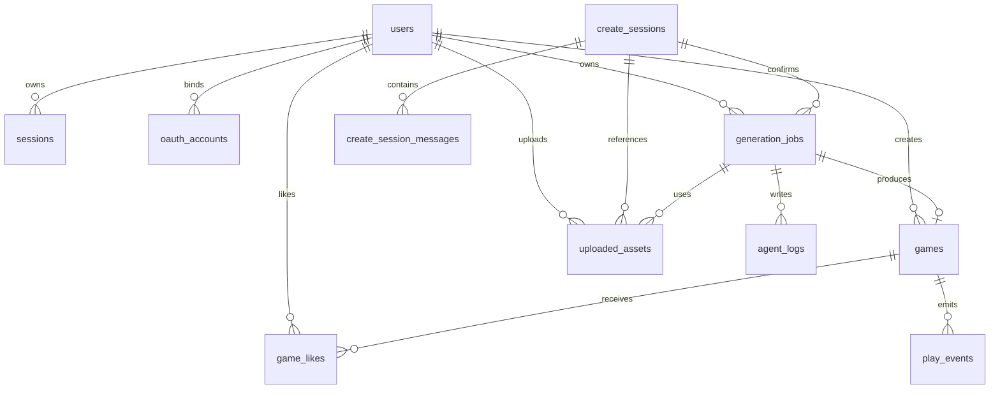

# 系统设计文档

## 1. 文档目标

本文档基于 [design-document.md](/Users/root1/workspace/Yahaha_Game/Yahaha_Game/docs/design-document.md) 重新整理，聚焦系统设计交付需要覆盖的核心内容：

- 提交架构图。
- 核心接口。
- 数据模型。
- Agent 工作流。
- 远端产物协议。
- 安全方案。
- 已知问题。

本文档不替代产品页面设计、详细 API 契约和实现计划。页面功能与布局以 [pages-design.md](/Users/root1/workspace/Yahaha_Game/Yahaha_Game/docs/pages-design.md) 为准，字段级 API 契约以 [api-contract.md](/Users/root1/workspace/Yahaha_Game/Yahaha_Game/docs/api-contract.md) 为准。


## 2. 总体架构

### 2.1 架构图

系统采用前端 SPA、FastAPI 后端、PostgreSQL 状态存储、MinIO 对象存储和 LangGraph Agent 编排的分层架构。Create 先以 `create_session` 收敛方案，再以 `generation_job` 驱动后台生成，Play 通过后端 meta 加载远端 `manifest` 与 bundle。详细设计见 [docs/design-document.md](./docs/design-document.md)、[docs/tech-stack.md](./docs/tech-stack.md) 和 [docs/implementation-plan.md](./docs/implementation-plan.md)。


### 2.2 Layer 边界

| Layer | 职责 |
| --- | --- |
| 前端层 | Home、Create、Play、Auth Modal、错误反馈、Console 输出、iframe 运行容器。 |
| API 层 | 鉴权、游戏、会话、任务、上传、游玩事件等 HTTP 接口。 |
| 数据层 | 用户、OAuth 绑定、Session、游戏、任务、素材、日志和游玩事件持久化。 |
| 存储层 | 私有上传素材、私有 draft 产物、公开 published 产物。 |
| Agent 层 | 对话设计、后台生成、资源处理、代码生成、产物校验。 |
| 运行时层 | Play 加载 manifest，并在 sandboxed iframe 中运行远端静态游戏 bundle。 |


## 3. 核心接口

### 3.1 Auth

| 方法 | 路径 | 权限 | 说明 |
| --- | --- | --- | --- |
| `POST` | `/api/auth/register` | 公开 | 邮箱注册，成功后写入 httpOnly session cookie。 |
| `POST` | `/api/auth/login` | 公开 | 邮箱登录，成功后写入 httpOnly session cookie。 |
| `POST` | `/api/auth/logout` | 登录 | 退出登录，使服务端 session 失效。 |
| `GET` | `/api/auth/me` | 公开 | 获取当前登录态；未登录返回 `authenticated=false`。 |
| `GET` | `/api/auth/oauth/google/start` | 公开 | 发起 Google OAuth 授权。 |
| `GET` | `/api/auth/oauth/google/callback` | 公开回调 | 完成 Google OAuth 账号创建、绑定和 session 写入。 |
| `GET` | `/api/auth/oauth/github/start` | 公开 | GitHub OAuth 入口占位，MVP 可返回未启用。 |
| `GET` | `/api/auth/oauth/github/callback` | 公开回调 | GitHub OAuth 回调占位，后续版本实现。 |

### 3.2 Games

| 方法 | 路径 | 权限 | 说明 |
| --- | --- | --- | --- |
| `GET` | `/api/games` | 公开 | 获取 published 游戏列表，支持排序、搜索和标签筛选。 |
| `GET` | `/api/games/{game_id}` | published 公开；draft 仅 owner | 获取游戏 meta、manifest URL 和产物基础 URL。 |
| `POST` | `/api/games/{game_id}/like` | 登录 | 点赞游戏；MVP 只做新增点赞，不做取消点赞。 |
| `POST` | `/api/games/{game_id}/publish` | owner | 发布自己的 draft 游戏。 |
| `DELETE` | `/api/games/{game_id}` | owner | 删除自己的 draft 或未发布产物；采用逻辑删除。 |

### 3.3 Create Sessions 与 Jobs

| 方法 | 路径 | 权限 | 说明 |
| --- | --- | --- | --- |
| `POST` | `/api/create-sessions` | 登录 | 创建确认前对话会话。 |
| `POST` | `/api/create-sessions/{session_id}/events` | owner | 发送 `chat / upload_assets / regenerate / confirm` 对话事件。 |
| `GET` | `/api/create-sessions/{session_id}` | owner | 读取会话、当前方案、最近 AI 回复和消息历史。 |
| `POST` | `/api/jobs` | 登录 | 基于 confirmed `create_session` 创建生成任务。 |
| `GET` | `/api/jobs` | 登录 | 获取自己的任务历史，必须返回关联 `session_id`。 |
| `GET` | `/api/jobs/{job_id}` | owner | 获取任务状态、关联会话、产物地址和错误信息。 |
| `GET` | `/api/jobs/{job_id}/logs` | owner | 获取 Agent 执行日志。 |
| `POST` | `/api/jobs/{job_id}/revisions` | owner | 后续版本：基于已生成任务创建 revision job。 |

### 3.4 Uploads 与 Play Events

| 方法 | 路径 | 权限 | 说明 |
| --- | --- | --- | --- |
| `POST` | `/api/uploads/presign` | 登录 | 获取上传素材的 presigned URL。 |
| `POST` | `/api/uploads/complete` | 登录 | 上传完成后登记文件元信息。 |
| `POST` | `/api/play-events` | 公开 | 记录 view、manifest_loaded、started、failed、timeout、exited 等事件。 |

### 3.5 通用响应约定

- API base URL 由前端环境变量配置。
- 认证使用服务端 session 和 `httpOnly` cookie。
- 前端请求需要携带 cookie。
- 成功响应使用 JSON。
- 错误响应统一为：

```json
{
  "error": {
    "code": "string",
    "message": "string",
    "retry_hint": "string|null"
  }
}
```

## 4. 数据模型

### 4.1 关系概览



### 4.2 核心表

#### users

| 字段 | 类型 | 说明 |
| --- | --- | --- |
| `user_id` | uuid | 系统唯一用户 ID，主键。 |
| `email` | varchar nullable | 用户邮箱，不作为系统唯一身份。 |
| `password_hash` | varchar nullable | 邮箱注册用户的密码哈希；OAuth-only 用户为空。 |
| `display_name` | varchar nullable | 展示名。 |
| `avatar_url` | text nullable | 头像 URL。 |
| `created_at` | timestamp | 创建时间。 |
| `updated_at` | timestamp | 更新时间。 |

#### oauth_accounts

| 字段 | 类型 | 说明 |
| --- | --- | --- |
| `oauth_id` | uuid | OAuth 绑定 ID，主键。 |
| `user_id` | uuid | 外键，关联 `users.user_id`。 |
| `provider` | varchar | `google / github`。 |
| `provider_user_id` | varchar | 第三方平台用户唯一 ID。 |
| `provider_email` | varchar | 第三方平台返回邮箱。 |
| `provider_name` | varchar | 第三方平台展示名。 |
| `avatar_url` | text | 第三方头像 URL。 |
| `access_token_encrypted` | text nullable | 加密后的访问令牌；MVP 可不长期保存。 |
| `refresh_token_encrypted` | text nullable | 加密后的刷新令牌；MVP 可不长期保存。 |
| `created_at` | timestamp | 绑定时间。 |
| `updated_at` | timestamp | 更新时间。 |

约束：`(provider, provider_user_id)` 唯一；第三方 token 不允许明文存储。

#### sessions

| 字段 | 类型 | 说明 |
| --- | --- | --- |
| `session_id` | uuid | session ID，主键。 |
| `user_id` | uuid | 外键，关联 `users.user_id`。 |
| `expires_at` | timestamp | 过期时间。 |
| `last_seen_at` | timestamp nullable | 最近访问时间。 |
| `user_agent` | text nullable | 登录设备 UA。 |
| `ip_address` | varchar nullable | 登录 IP。 |
| `created_at` | timestamp | 创建时间。 |

#### games

| 字段 | 类型 | 说明 |
| --- | --- | --- |
| `id` | uuid | 游戏 ID。 |
| `owner_id` | uuid | 创建者。 |
| `title` | varchar | 游戏标题。 |
| `description` | text | 简介。 |
| `cover_url` | text | 封面 URL。 |
| `tags` | text[] | 标签。 |
| `status` | varchar | `draft / published / deleted`。 |
| `manifest_url` | text | manifest public 或授权 URL。 |
| `artifact_base_url` | text | 产物基础 URL。 |
| `play_count` | integer | 游玩次数。 |
| `like_count` | integer | 点赞次数。 |
| `published_at` | timestamp | 发布时间。 |
| `created_at` | timestamp | 创建时间。 |
| `updated_at` | timestamp | 更新时间。 |

#### game_likes

| 字段 | 类型 | 说明 |
| --- | --- | --- |
| `id` | uuid | 点赞记录 ID。 |
| `game_id` | uuid | 游戏 ID。 |
| `user_id` | uuid | 点赞用户 ID。 |
| `created_at` | timestamp | 点赞时间。 |

约束：同一用户对同一游戏最多点赞一次，使用 `(game_id, user_id)` 唯一约束。

#### create_sessions

| 字段 | 类型 | 说明 |
| --- | --- | --- |
| `id` | uuid | Create 对话会话 ID。 |
| `user_id` | uuid | 创建者。 |
| `status` | varchar | `collecting / ready_to_confirm / confirmed / error`。 |
| `user_requirements` | jsonb | 用户需求摘要。 |
| `game_plan` | jsonb | 当前完整游戏方案。 |
| `material_usage` | jsonb | 素材用途计划。 |
| `assistant_response` | jsonb | 最近一轮 AI 回复、建议答案和卡片。 |
| `created_at` | timestamp | 创建时间。 |
| `updated_at` | timestamp | 更新时间。 |
| `confirmed_at` | timestamp nullable | 用户点击生成并确认当前方案的时间。 |

#### create_session_messages

| 字段 | 类型 | 说明 |
| --- | --- | --- |
| `id` | uuid | 消息 ID。 |
| `session_id` | uuid | 关联 Create 对话会话。 |
| `role` | varchar | `user / assistant / system`。 |
| `content` | text | 消息正文。 |
| `payload` | jsonb nullable | 建议答案、卡片快照、附件摘要、事件类型等展示补充。 |
| `created_at` | timestamp | 消息创建时间。 |

#### generation_jobs

| 字段 | 类型 | 说明 |
| --- | --- | --- |
| `id` | uuid | 任务 ID。 |
| `user_id` | uuid | 创建者。 |
| `prompt` | text | 用户创意。 |
| `status` | varchar | `pending / running / succeeded / failed`。 |
| `create_session_id` | uuid nullable | 关联 Create 对话会话。 |
| `parent_job_id` | uuid nullable | 生成后修改时指向上一版任务。 |
| `revision_intent` | text nullable | 生成后修改意图摘要。 |
| `user_requirements` | jsonb | 确认时用户需求快照。 |
| `game_plan` | jsonb | 确认时游戏方案快照。 |
| `material_usage` | jsonb | 确认时素材用途快照。 |
| `game_id` | uuid | 成功后关联 draft game。 |
| `artifact_prefix` | text | 产物对象存储路径。 |
| `error_message` | text | 失败原因。 |
| `created_at` | timestamp | 创建时间。 |
| `started_at` | timestamp | 开始时间。 |
| `finished_at` | timestamp | 结束时间。 |

#### uploaded_assets

| 字段 | 类型 | 说明 |
| --- | --- | --- |
| `id` | uuid | 上传素材 ID。 |
| `user_id` | uuid | 上传者。 |
| `session_id` | uuid nullable | 关联 Create 对话会话。 |
| `job_id` | uuid nullable | 关联生成任务。 |
| `filename` | varchar | 原始文件名。 |
| `mime_type` | varchar | MIME type。 |
| `size_bytes` | bigint | 文件大小。 |
| `object_key` | text | MinIO object key。 |
| `purpose` | text | 用户填写或系统推断的用途说明。 |
| `created_at` | timestamp | 上传时间。 |

#### agent_logs

| 字段 | 类型 | 说明 |
| --- | --- | --- |
| `id` | uuid | 日志 ID。 |
| `job_id` | uuid | 任务 ID。 |
| `step` | varchar | 步骤名。 |
| `level` | varchar | `info / warning / error`。 |
| `message` | text | 可读日志摘要。 |
| `created_at` | timestamp | 记录时间。 |

#### play_events

| 字段 | 类型 | 说明 |
| --- | --- | --- |
| `id` | uuid | 事件 ID。 |
| `game_id` | uuid | 游戏 ID。 |
| `user_id` | uuid nullable | 登录用户可记录，游客为空。 |
| `event_type` | varchar | `view / manifest_loaded / started / failed / timeout / exited`。 |
| `metadata` | jsonb | 阶段、耗时、错误原因、URL 类型等；不记录 secret。 |
| `created_at` | timestamp | 事件时间。 |

## 5. Agent 工作流

### 5.1 总体原则

Agent 对外只暴露一个 `Agent Runner` 入口，由后端 `generation_job` 调用；内部可以使用多 Agent 协作。系统按阶段拆分：

- 阶段 A：对话设计阶段。
- 阶段 B：后台生成阶段。

推荐角色：

| 角色 | 职责 |
| --- | --- |
| Orchestrator | LangGraph 编排层，负责状态流转、任务派发和收口。 |
| Design Agent | 与用户对话，补齐需求，沉淀游戏方案、素材用途和确认卡片。 |
| Asset Agent | 处理或生成背景图、玩家图和独立封面图。 |
| Coding Agent | 根据开发 brief 生成静态游戏 bundle，并在资源到齐后自调试。 |
| Validator Agent | 做最终交付验收、协议校验和安全检查。 |

### 5.2 阶段 A：对话设计


目标：把用户的自然语言想法、补充要求和上传素材意图收敛成可确认游戏方案。

输入：

- 用户聊天消息。
- 上传素材元信息。
- 当前 `user_requirements`。
- 当前 `game_plan`。
- 当前 `material_usage`。

输出：

- `user_requirements`：用户需求摘要。
- `game_plan`：完整游戏方案，包含标题、介绍、标签、玩法、风格、角色和胜负条件。
- `material_usage`：素材用途计划。
- `assistant_response`：AI 回复、建议答案和确认卡片。

事件路由：

| 事件 | 含义 | 处理 |
| --- | --- | --- |
| `chat` | 用户发送新消息 | 更新需求摘要、游戏方案和回复。 |
| `upload_assets` | 用户上传附件 | 更新素材用途，必要时轻微更新方案展示文案。 |
| `regenerate` | 用户点击「换一换」 | 保留需求和素材用途，重新生成另一版方案。 |
| `confirm` | 用户点击「生成」 | 锁定当前方案，进入后台生成。 |

### 5.3 阶段 B：游戏生成

  


目标：在用户确认后生成可运行的远端静态游戏产物。

流程：

1. 后端创建 `generation_job`，写入 confirmed 会话快照。
2. Agent Runner 初始化生成状态。
3. Orchestrator 解析 `user_requirements`、`game_plan`、`material_usage` 和 `uploaded_assets`。
4. Orchestrator 生成 `development_brief`、`asset_work_order` 和 `asset_manifest_plan`。
5. LangGraph 并发调用 Coding Agent 和 Asset Agent。
6. Coding Agent 生成 `index.html`、`style.css`、`game.js` 和 `manifest_draft`。
7. Asset Agent 处理或生成 `background.png`、`player.png`，并始终独立生成 `cover.png`。
8. Coding Agent 汇合代码和真实资源，自调试 bundle、修正资源引用和 manifest。
9. Validator Agent 验收产物协议、安全边界和调试证据。
10. 验收通过后，后端保存 draft game、artifact prefix、manifest 路径和 Agent 日志。
11. 验收失败时，任务进入 `failed`，记录 `failed_step`、`error_message`、`retry_hint` 和日志。


## 6. 远端产物协议

每个生成游戏版本是一个静态 bundle：

```text
manifest.json
index.html
style.css
game.js
assets/*
```

`manifest.json` 示例：

```json
{
  "schemaVersion": "1.0",
  "title": "Space Runner",
  "description": "A small arcade game generated from user prompt.",
  "entry": "index.html",
  "styles": ["style.css"],
  "scripts": ["game.js"],
  "assets": ["assets/cover.png"],
  "cover": "assets/cover.png",
  "controls": ["Arrow keys to move", "Space to jump"],
  "runtime": "html5-iframe",
  "generatedAt": "2026-06-19T00:00:00Z"
}
```

对象存储路径建议：

```text
uploads/{user_id}/{upload_id}/{filename}
drafts/{user_id}/{job_id}/{version}/manifest.json
drafts/{user_id}/{job_id}/{version}/index.html
published/{game_id}/{version}/manifest.json
published/{game_id}/{version}/index.html
published/{game_id}/{version}/assets/*
```

访问策略：

| 路径 | 策略 | 说明 |
| --- | --- | --- |
| `uploads/*` | 私有 | 通过 presigned URL 上传和读取。 |
| `drafts/*` | 私有 | 仅创建者通过后端授权预览。 |
| `published/*` | public-read | Play 可直接加载公开产物。 |

Play 加载链路：

1. 前端请求 `GET /api/games/{game_id}` 获取 meta。
2. 前端从 meta 读取 `manifest_url`。
3. 前端加载 MinIO public-read `manifest.json`。
4. 前端读取 `entry`，将 `index.html` 作为 iframe 入口。
5. iframe 使用 sandbox 限制能力。
6. 父页面与 iframe 只通过 `postMessage` 通信。

超时规则：

| 阶段 | 阈值 |
| --- | --- |
| meta 加载 | `10s` |
| manifest 加载 | `10s` |
| bundle / iframe ready | `20s` |

## 7. 安全方案

### 7.1 会话与 OAuth 安全

- 使用服务端 session。
- Session ID 通过 `httpOnly` cookie 存储。
- Cookie 设置 `SameSite=Lax`。
- 生产环境启用 `Secure`。
- 密码使用强哈希算法存储，不能明文保存。
- Google OAuth 必须使用 `state` 参数防止 CSRF。
- OAuth client secret 只能存在后端环境变量中，不能暴露给前端。
- 第三方 access token 如需保存必须加密；MVP 优先不长期保存 token。

### 7.2 上传安全

- 任意文件上传只进入私有 MinIO 路径。
- 后端校验文件大小和基础 MIME 信息。
- 上传文件不在后端执行。
- Agent 只能通过授权 URL 读取素材。
- 公开产物和原始上传素材分开存储。
- 不在响应、Console 或日志中暴露完整 presigned URL 签名。

### 7.3 Play 运行隔离

- 生成游戏在 sandboxed iframe 中运行。
- iframe 使用 `sandbox="allow-scripts"`。
- 不启用 `allow-same-origin`、`allow-forms`、`allow-popups`、`allow-top-navigation`。
- iframe 禁止访问父页面 DOM。
- iframe 禁止读取父页面 cookie 和 localStorage。
- iframe 禁止打开弹窗或跳转顶层页面。
- iframe 禁止访问摄像头、麦克风和剪贴板。
- 后端不执行生成游戏中的 JS。
- published bundle 只作为静态文件加载。
- Play 加载失败或超时时展示错误态，不白屏。

### 7.4 postMessage 白名单

允许 iframe 向父页面发送的消息类型：

| 类型 | 说明 |
| --- | --- |
| `game_ready` | 游戏初始化完成。 |
| `game_error` | 游戏运行报错。 |
| `game_exit` | 游戏主动退出。 |
| `game_metric` | 游戏运行指标。 |

父页面必须校验：

- `event.source`。
- 消息 schema。
- 关联 `game_id`。
- 未知消息忽略，并输出 `console.warn`。

### 7.5 密钥与日志安全

- `.env.example` 只列变量名和用途，不提交真实密钥。
- OpenAI-compatible API key 只存在后端环境变量中。
- 前端不能直接接触模型服务密钥。
- Console、服务端日志和数据库事件不记录 secret、token、password、OAuth code、API key 或完整 presigned URL 签名。

## 8. 可观测性

MVP 不做用户可见监控看板，只写浏览器 Console、数据库事件和服务端日志。

前端 Console 至少输出：

- Home 列表请求、排序、筛选和点赞结果。
- Create 会话、上传、Agent、任务状态、产物和发布状态。
- Play meta、manifest、bundle、iframe ready、错误日志和阶段耗时。
- Auth 登录成功、登录失败和 session 摘要。

数据库事件至少记录：

- Play `view`。
- Play `manifest_loaded`。
- Play `started`。
- Play `failed`。
- Play `timeout`。
- Play `exited`。
- 生成任务状态变化。
- Publish 成功或失败。

服务端日志至少记录：

- 认证失败与 OAuth 回调失败。
- 文件上传登记失败。
- 生成任务异常。
- Publish 异常。
- Play events 写入异常。

## 9. 已知问题与取舍

### 9.1 MVP 不做

- 独立 Auth 页面，统一使用 Auth Modal。
- 独立 Game Detail 页面，改成Play 左侧承载轻量游戏详情。
- 收藏功能。
- 发布后编辑标题、简介、标签和封面。
- 取消发布。
- 用户已发布游戏管理页。
- 平台维护者后台。
- 生成中 Cancel。
- 完整 Retry、版本管理 UI 和 Remix 派生。
- 安全沙箱可视化配置。
- 内容审核面板。
- 资源限额展示。
- 生成成本统计。
- GitHub OAuth 真实跑通。

### 9.2 已知技术取舍

- 异步任务使用 FastAPI BackgroundTasks，不引入 Celery。
- Mock provider 仅用于本地兜底和 CI，不作为生产生成链路。
- Create 上传素材用途由 AI 自动推断；用户如需修改用途，通过继续聊天让 AI 更新素材用途计划。
- Play sandbox 边界不在界面上解释，只在实现和文档中体现。
- Play 前后端埋点不显示给用户，只写 Console、数据库事件和服务端日志。
- Play 超时阈值采用 meta `10s`、manifest `10s`、bundle / iframe ready `20s`，重试时重新加载整个 Play 链路。
